# Terminal|deepin-terminal|

## Overview

Terminal is a terminal emulator with simple interface providing diversified powerful functions including multi-windows, workspace, remote management, Quake mode, among others. You can instantly start and close Terminal smoothly like any normal file windows, refraining you from limitations and hassles while writing commands. Take a try of the Quake mode which enables you to browse other windows while inputting commands on one screen. When there are multiple tasks, you can add tabs in terminal to create more workspaces like in the browser or split the workspace into multiple windows. It's also a piece of cake to upload and download files with remote management. More powerful functions are waiting for you to explore!

 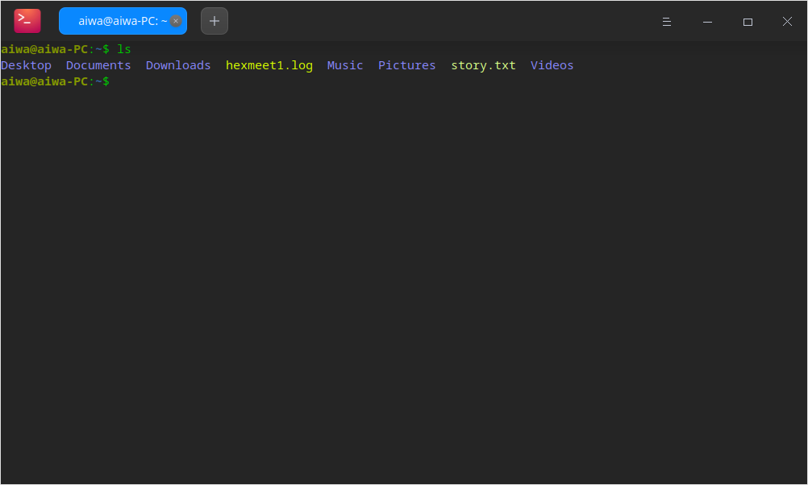

## Guide

You can run, exit or create shortcuts for Terminal.

### Run Terminal 

1. Click the Launcher icon  in the Dock to enter launcher interface.
2. Locate Terminal  by scrolling the mouse wheel or searching "terminal" in the Launcher interface and click it to run.
3. Right-click  to: 
 - Select **Send to desktop** to create a desktop shortcut.
 - Select **Send to dock** to fix it in the Dock.
 - Select **Add to startup** to add the application to startup and it will automatically run when the system starts up.

> Notes: You can also press **Ctrl** + **Alt** + **T** to open Terminal.

### Exit Terminal 

1. On the Terminal interface, click   to exit.
2. Right-click  in the Dock and select **Close All** to exit.
3. On the Terminal interface, click  to select **Exit**.

> Notes: A prompt will display when programs are still running in Terminal to avoid your data loss.

### View Shortcuts

On the Terminal interface, press **Ctrl + Shift + ?** to view shortcuts. Proficiency in shortcuts will greatly improve your efficiency.

 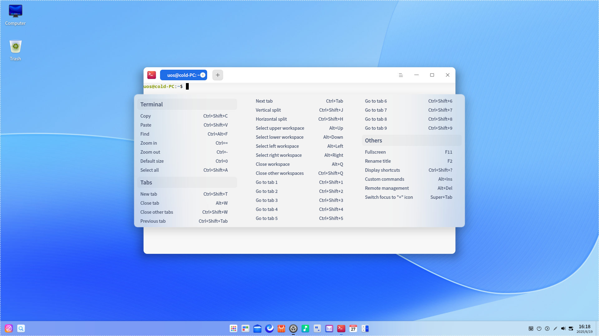

## Basic Operations

You can right-click on the Terminal interface for daily operations.

 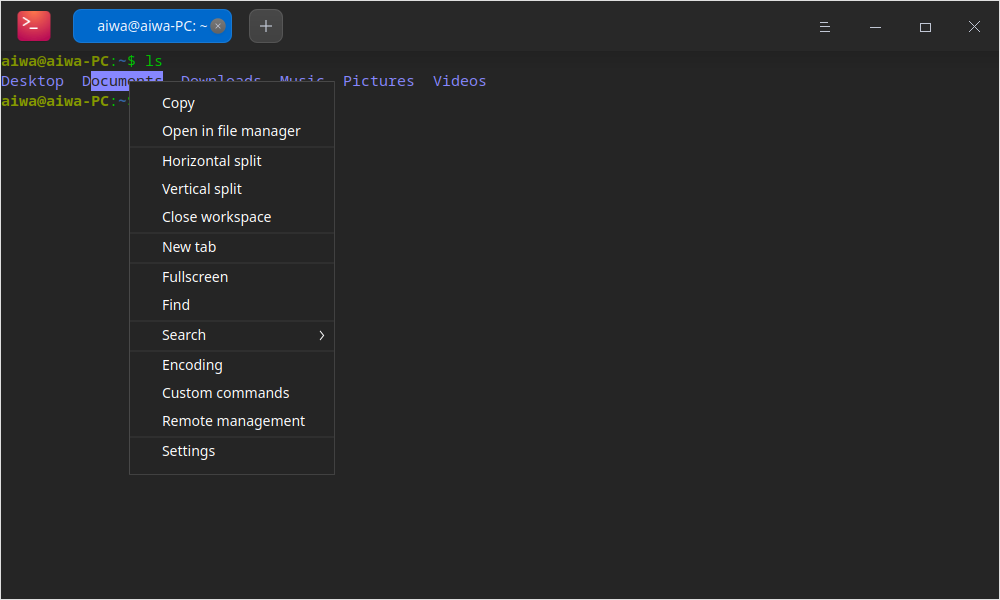

### Find 

You can use **Find** function to quickly search contents in terminal.

1. Right-click on the Terminal interface to select **Find** or click the **Ctrl** + **Alt** + **F** key on the keyboard.
2. Type the word in the search box.
3. Press the **Enter** key on the keyboard and the search results will be highlighted.
4. Press **Esc** on the keyboard or click any blank area on the Terminal interface to hide search.

> Tips: Press **Enter** to search down from the current location. You can also search by clicking  and  on the interface.

### Web Search

You can use browser in Terminal for quick and convenient web search against selected content on the Terminal interface. 

1. On the Terminal interface, select the content you want to search.
2. Right-click to select **Search**.
3. Select a search website.
4. Your browser will pop up and start searching based on the content selected on the Terminal interface.

### Copy/Paste

- Copy
   - On the Terminal interface, select the content you want to copy and press **Ctrl** + **Shift** + **C**.
   - On the Terminal interface, select the content you want to copy, right-click and select **Copy**.
- Paste
   - On the Terminal interface, press **Ctrl** + **Shift** + **V**.
   - On the Terminal interface, middle-click to paste.
   - On the Terminal interface, right-click and select **Paste**.

>   Tips: 
> - If you want to copy a hyperlink, you don't need to select any content. Just simply copy it with a right-click.
> - Check **Copy on select** in **Settings** under the main menu to copy the selected text to clipboard automatically.

### Select Quake Mode

Quake Mode is a unique function of Terminal. Press **Alt** + **F2** to open a quake window, and press again to hide it.

>  Tips: You can also right-click  in the Dock to select **Quake Terminal** to open a quake window.

### Open Files and Applications 

On the Terminal interface, select the file in the current directory and right-click to **Open** it by system application.

1. On the Terminal interface, input **ls -al** to display files in current directory.
2. Double-click to select the file name.
3. Right-click and select **Open**.
4. The file will be opened with the proper application.

 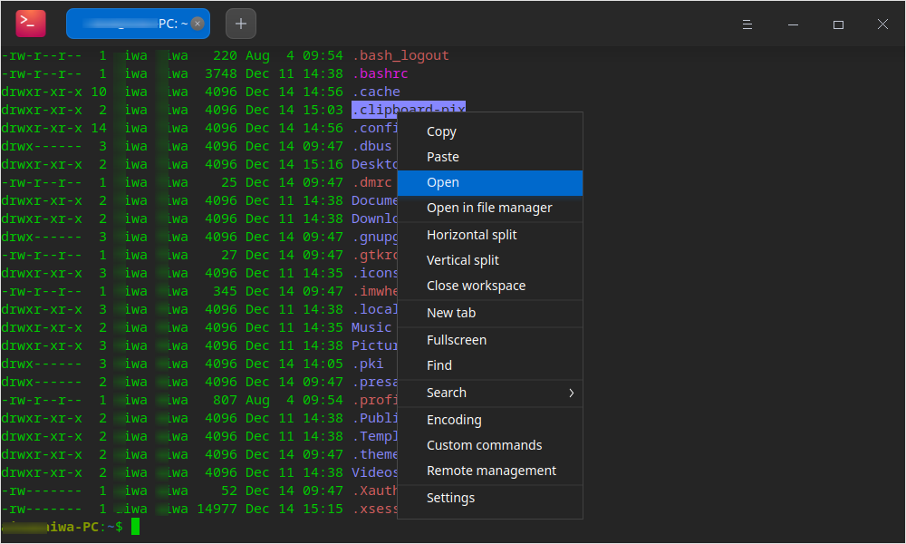

### Adjust Encoding Methods 

When there is a messy code or display error, you may switch the encoding to solve it.

1. On the Terminal interface, right-click to select **Encoding**.
2. Select one encoding in the list to see if the content is correctly displayed.
3. Repeat Step 2 until you get correct display of content.

> Notes: Usually, correct encoding methods are matched automatically in Terminal. Once any error appears under some special circumstances, you can adjust encoding methods manually. You can directly choose the correct encoding method if you are sure of it. If you are not sure, you can try multiple times.  

## Window Operations

Window serves as the foundation for your operations in Terminal. A window is created when you launch the terminal. You can create many tabs in one window and split one tab or window into multiple workspaces.

### Create Windows 

You can create a new window in the following ways:

- Open Terminal and click > **New Window**.
- Click  in the Dock to select **New Window**.

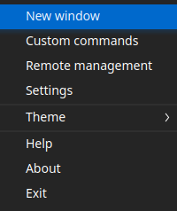

### Display Windows in Fullscreen

1. Open Terminal in the launcher interface.
2. Press **F11** to display Terminal in fullscreen.
3. If you want to restore to the normal display, please press **F11**.

>  Notes: You can also right-click to select **Fullscreen** or **Exit fullscreen** on the Terminal interface.

### Split Windows 

1. On the Terminal interface, right-click to:

  - Select **Vertical split** to split the interface into left and right columns.
  - Select **Horizontal split** to split the interface into top and bottom rows.

2. You can input commands in each terminal window, and view execution results of different commands in different windows simultaneously.

> Tips: You can also press **Ctrl**+ **Shift** +**J** on the keyboard to split windows vertically, and press **Ctrl** + **Shift** + **H** to split windows horizontally.

 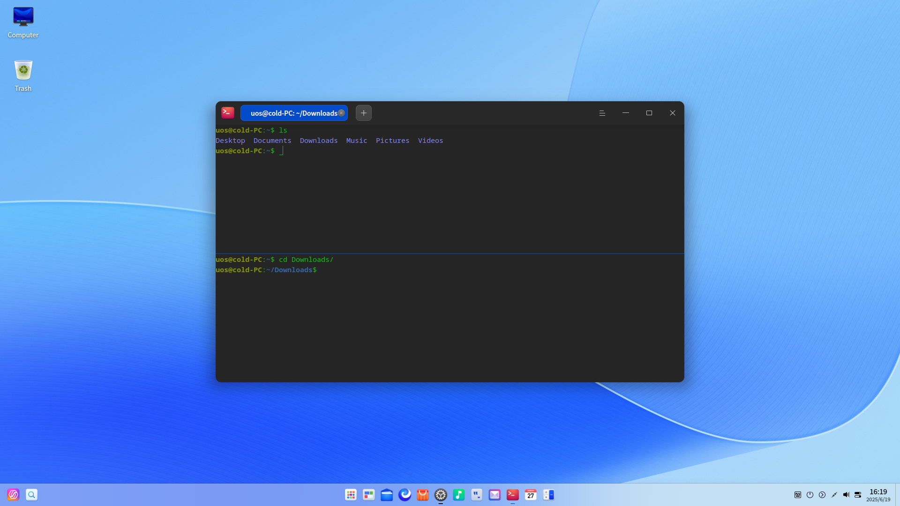

### Close Workspaces 

You can close multiple split workspaces in the following steps:

1. On the Terminal interface, move the cursor over one of the split workspaces.
2. Right-click to:

  - Select **Close workspace** to close this split workspace.
  - Select **Close other workspaces** to close other split workspaces except for the current one.

 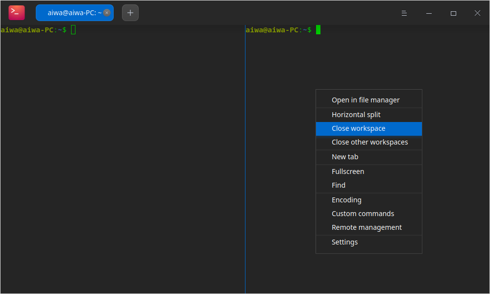

## Tab Operations

### Create Tabs 

You can create new tabs as follows:

- On the Terminal interface, right-click and select **New tab** to create a new tab.
- Click  on the top to create a tab.
- Press **Ctrl** + **Shift** + **T** on the keyboard to create a new tab.

### Switch/Adjust Tabs 

You can freely switch among multiple tabs via following methods:

- Press **Ctrl** + **Tab** or scroll the mouse wheel on the tab title to switch in sequence.
- Press **Ctrl** + **Shift** + **1~9** number keys to select the tab. When there are more than 9 tabs, the last tab will be selected rather the ninth one.
- Drag one tab to switch sequence in the one window.
- Drag one tab out of the current window to create a new window.
- Drag one tab out of the current window to another window.

### Rename Tabs 

1. On the Terminal interface, right-click a tab and select **Rename title**.

  - Tab title format: Select one format in the **Insert** drop-down list and you can customize the current tab title as needed.
  - Remote tab title format: Select one format in the **Insert** drop-down list and you can customize the remote tab title as needed.

2. Click **Confirm**.

> Tips: You can also press **F2**  to rename the window.

 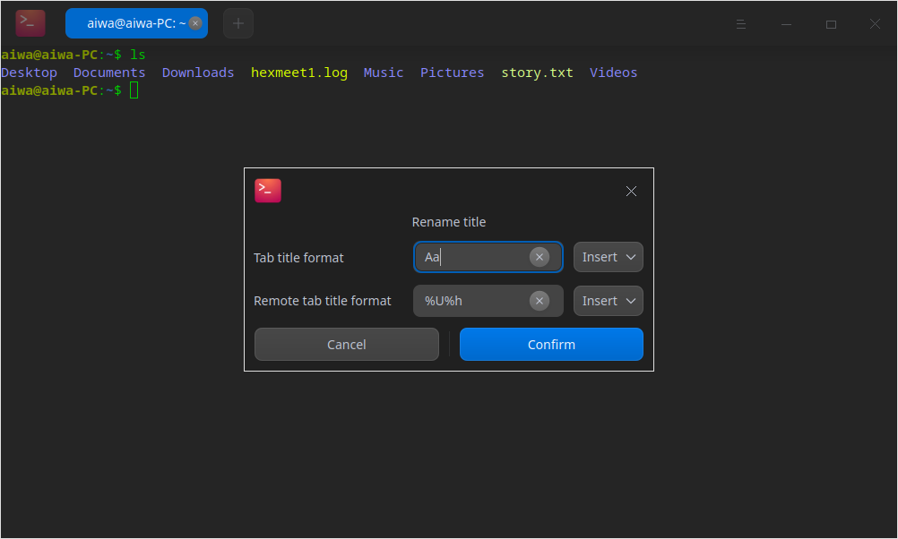

### Close Tabs 

You can close tab as follows:

1. Select the tab to be closed and click  .
2. Right-click any tab to:
 - Select **Close tab** to close it.
 - Select **Close other tabs** to close other tabs other than the current one.

> Tips: When there is only one tab in the workspace, you can also right-click and select **Close workspace** to close the tab.

## Remote Management

You can open remote management panel to add remote servers via the main menu or right-click menu. Once a remote server is added into the management list, you can automatically login just by one click. 

### Add Servers 

1. On the Terminal interface, click > **Remote management**.
2. Click **Add Server** and a pop-up box will display.
3. Fill out **Server name**, **Address**, **Username** and **Password**.
4. Click **Add**.

   >  Notes: If you need to set up more parameters, please click **Advanced options**. 

 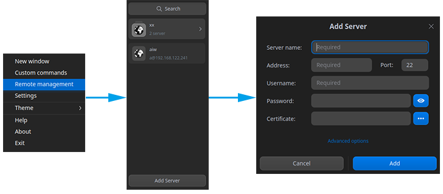

### Edit Servers 

1. On the Remote Management interface, click  on the server.
2. Edit server information as needed.
3. Click **Save**.

 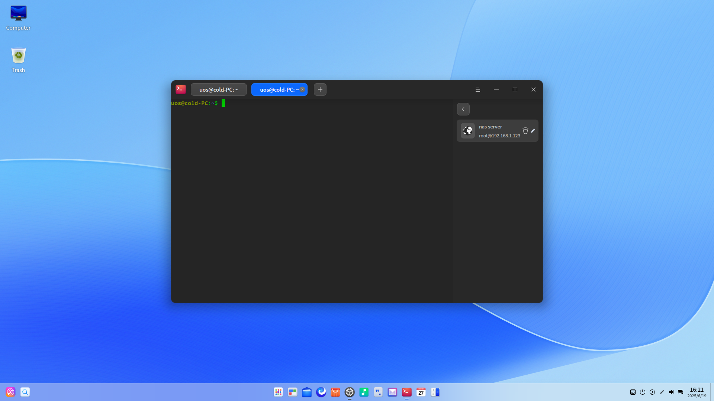

### Group Servers 

When you set a group for a server, it will be added in the corresponding group and displayed in the remote management panel on the right side.

1. On the terminal interface, click the **Add Server** icon to open the Add Server dialogue or click the icon beside an existing server to open the Edit Server dialogue.
2. Click **Advanced options**.
3. Input **Group** information.
4. Click **Save**.

 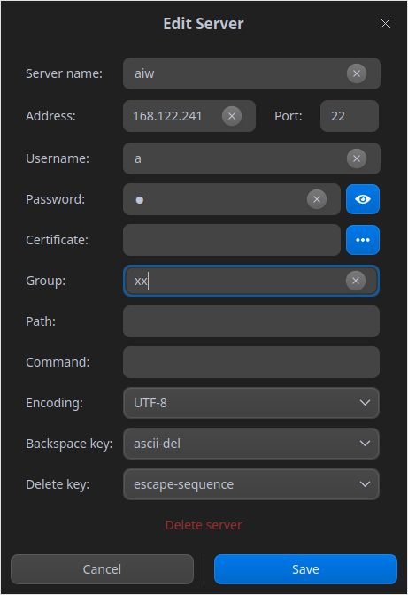

### Search Servers 

When there are multiple servers or groups, the search box will be displayed on the top, so you can quickly search all servers.

1. On the Terminal interface, right-click and select **Remote management**. 
2. Input the keywords and press **Enter**.
3. The search results will be displayed.

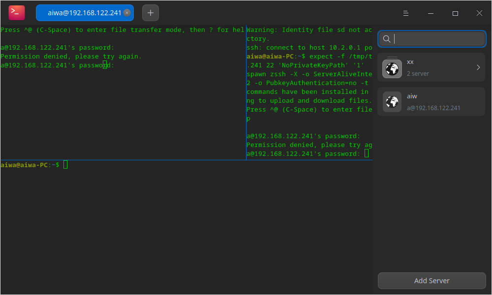

### Upload/Download Files 

You can upload and download files after logging into a remote server.

#### Upload Files 

1. On the Remote Management panel, select one server to log in.
2. On the Terminal interface, right-click to select **Upload file**.
3. Select the file to be uploaded in the pop-up window.
4. Click **Upload** and the file will be uploaded to the remote server.

> Tips: You can drag the file directly into the terminal interface to upload after connecting the remote server.

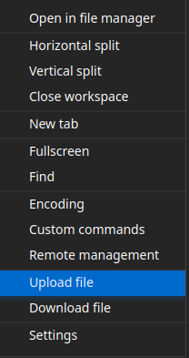

#### Download Files 

1. On the Remote Management panel, select one server to log in.
2. On the Terminal interface, right-click to select **Download file**.
3. Select the storage location.
4. Input the path of the file to be downloaded. The file will be downloaded to the specified location.

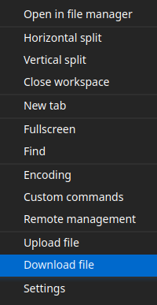

### Delete Servers 

1. Enter **Edit Server** interface.
2. Click **Advanced options**.
3. Select **Delete server**.
4. Click **Delete** on the pop-up window to confirm.

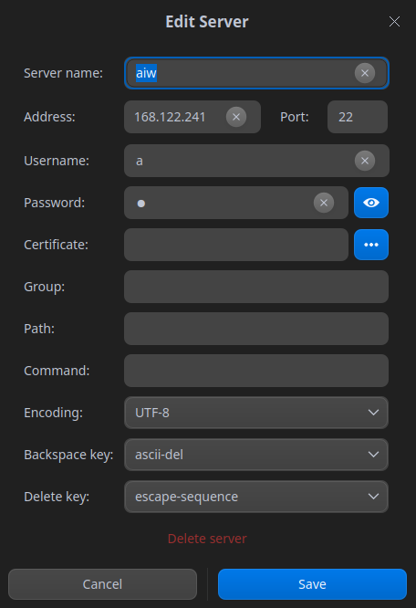

## Main Menu

In the Main Menu, you can [Create Windows](#Create Windows), customize commands,  perform [Remote Management](#Remote Management), switch themes, view help manual and get more information about Album.

### Theme 

The window theme provides multiple themes.

1. On the Terminal interface, click .
2. Click **Theme** and you can:

   - choose one theme that comes with Terminal.
   - customize the theme in the **Custom Theme** window according to your need.

### Custom Commands 

1. On the Terminal interface, click .
2. Select **Custom commands**.
3. Select **Add command**.
4. Input **Name**, **Command** and **Shortcuts**.
5. Click **Add**.

### Settings

#### Basic Settings

1. On the Terminal interface, click > **Settings**.
2. In the **Basic** options, you can:

   - Set **Opacity** for the background.
   
   >Notes: if Window Effect is turned off in Control Center, the **Opacity** scroll bar will be hidden.

   - Set the font type and size.
   - Click the "+" or "-" icon or scroll the mouse wheel in the Font Size edition box to adjust the font size.

3. In the **Tab titles** options, you can set the name for all the tabs and remote tabs in terminal.

#### Shortcuts Settings 

1. On the Terminal interface, click > **Settings**.
2. In the **Shortcuts** options, you can:

  - Modify shortcuts: Click the shortcuts to be modified and input new shortcuts via the keyboard in the editable input box.
  - Disable shortcuts: Click the shortcuts to be modified and the input box will be editable.  Press **Backspace** on the keyboard to disable the shortcut.

#### Advanced Settings 

1. On the Terminal interface, click > **Settings**.
2. In the **Advanced** options, you can:

  - Set **Cursor style**.
  - Enable or disable **Cursor blink**.
  - Enable or disable **Copy on select**.
  - Enable or disable **Scroll on keystroke**.
  - Enable or disable **Scroll on output**.
  - Set the window startup mode.
  - Enable or disable **Blur background**.
   >Notes: If Window Effect is turned off in Control Center, **Blur background** option will be hidden.

  - Enable or disable **Hide quake window after losing focus**.
  - Select **Shell profile**.
  - Enable or disable flow control by **Ctrl** + **S** and **Ctrl** + **Q**.

### Help

1. On the Terminal interface, click .
2. Click **Help** to view the manual of Terminal.

### About

1. On the Terminal interface, click .
2. Click **About** to view the version and introduction of Terminal.

### Exit

1. On the Terminal interface, click .
2. Click **Exit** to exit Terminal.
