# 終端|deepin-terminal|

## 概述

終端是一款集多窗口、工作區、遠程管理、雷神模式等功能的高級終端模擬器。它擁有簡單的界面，豐富而強大的功能，可以瞬間啟動和關閉，使用起來像普通文件窗口一樣流暢，讓您在輸入命令時心無旁騖，得心應手。試試雷神模式，一邊看頁面一邊輸入命令；當有多任務進行時，您可以像在瀏覽器中增加頁籤一樣建立多個工作區；遠程管理，上傳下載文件再也不是問題。更多強大功能，靜待您的發掘！

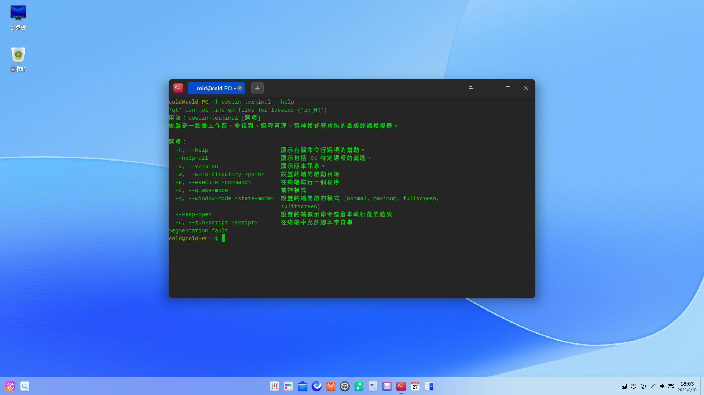

## 使用入門
通過以下方式運行或關閉終端，或者創建終端機的快捷方式。

### 運行終端機

1. 單擊任務欄上的啟動器圖標 ，進入啟動器界面。
2. 上下滾動鼠標滾輪瀏覽或通過搜索，找到終端圖標 ，單擊運行。
3. 右鍵單擊 ，您可以：
   - 單擊 **傳送到桌面**，在桌面創建快捷方式。
   - 單擊 **傳送到任務欄**，將應用程序固定到任務欄。
   - 單擊 **加至開機啟動**，將應用程序添加到開機啟動項，在電腦開機時自動運行該應用。

> 說明：使用快捷鍵 **Ctrl + Alt + T** 也可以啟動終端。

### 關閉終端機

- 在終端界面單擊 ，關閉終端。
- 在任務欄右鍵單擊 ，選擇 **關閉所有**，關閉終端。
- 在終端機界面單擊 ，選擇 **退出**，關閉終端。

> 說明：如果關閉終端時終端裏面依然有程序在運行，會彈出一個對話框詢問是否退出， 避免強制關閉引起的數據丟失。

### 查看快捷鍵

在終端界面，使用快捷鍵 **Ctrl + Shift + ?** 打開快捷鍵預覽界面。熟練地使用快捷鍵，將大大提升您的操作效率。

 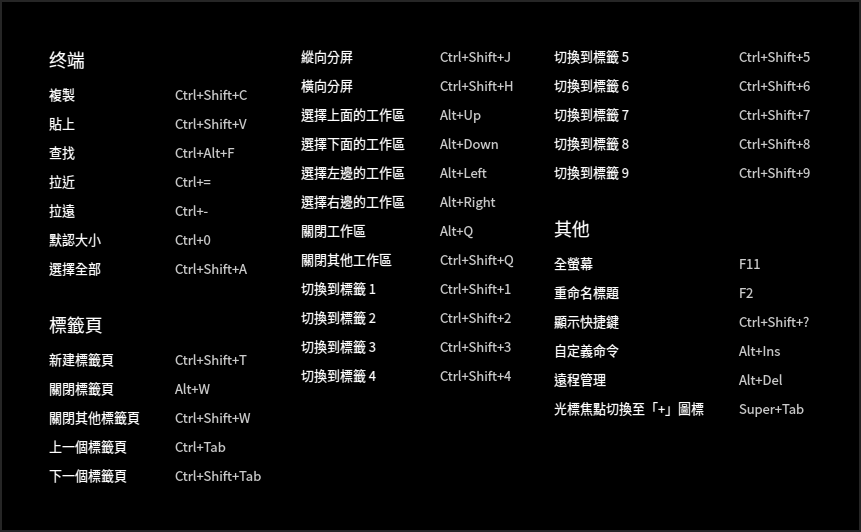

## 基本操作

您可以在終端界面單擊鼠標右鍵來進行常規操作。

### 查找
使用“查找”功能來快速查找終端顯示的內容。

1. 在終端界面，單擊鼠標右鍵。
2. 選擇 **查找**。
3. 在搜索框中輸入要查找的字符。
4. 按下鍵盤上的 **Enter** 鍵，搜索到的結果將高亮顯示。
5. 如果想隱藏搜索界面，可以單擊終端空白區域按下鍵盤上的 **Esc** 鍵。

> 竅門：搜索時按下鍵盤上的 **Enter** 鍵是從當前位置向下搜索，您也可以通過單擊搜索界面上的  或   按鈕來向上搜索或向下搜索。

### 網頁搜尋
終端可以調用瀏覽器搜尋終端中的內容，快捷又方便。

1. 在終端界面，選中想要搜尋的內容。
2. 單擊鼠標右鍵，選擇 **搜尋**。
3. 在子菜單中選擇一個網站來搜尋選中的內容。

### 複製和黏貼

- 複製
   + 在終端界面，選中要複製的內容後使用快捷鍵 **Ctrl + Shift + C** 複製內容。
   + 在終端機界面，選中要複製的內容後單擊鼠標右鍵選擇 **複製**。
- 黏貼
   + 在終端界面，使用快捷鍵 **Ctrl + Shift + V** 黏貼內容。
   + 在終端界面，單擊鼠標中鍵黏貼內容。
   + 在終端界面，單擊鼠標右鍵選擇 **黏貼**。

   > 竅門：
   > - 終端已默認開啟 **選中文字時自動複製到剪切板**，您可以在  > **設置** 中進行修改。
   > - 如果當前光標下是超鏈接內容，即使沒有選中任何內容，也可以通過右鍵菜單複製。

### 雷神模式

雷神模式是終端特有的便捷功能，只需使用快捷鍵 **Alt + F2** 就可以打開雷神終端窗口，再按一下 **Alt + F2** 隱藏雷神終端窗口。

> 竅門 ：您也可以右鍵單擊任務欄上的圖標 ，選擇 **雷神終端**，打開雷神模式的終端窗口。

### 開啟文件和應用程序

在終端界面上選中當前目錄下的文件，右鍵菜單會顯示 **開啟** 菜單項，單擊 **開啟** 調用系統中的應用來打開選中的文件。

1. 在終端界面，輸入 **ls -al** 顯示當前目錄下的文件。
2. 雙擊鼠標左鍵，選中文件名。
3. 單擊鼠標右鍵選擇 **打開**。

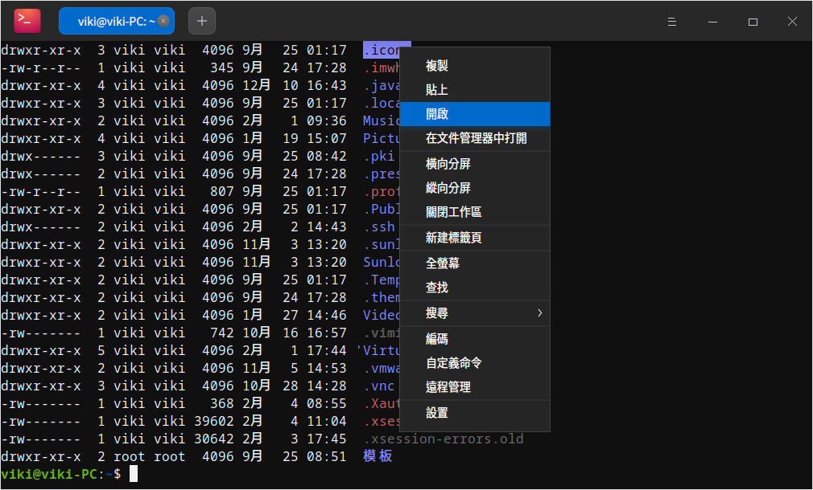

### 調整編碼方式
當某些文件訊息顯示亂碼或者錯誤時，可以通過調整編碼方式來解決問題。

1. 在終端界面，單擊鼠標右鍵。
2. 單擊 **編碼**。
3. 在右側展開的面板中，選擇一種編碼方式並查看調整後的效果。
4. 重複步驟3直到內容顯示正確。

> 說明：通常終端都會匹配正確的編碼方式，一些特殊情況下出現錯誤後，可以手動調整編碼方式，如果您確定需要哪種編碼方式可以直接選擇，不確定的情況下可以多嘗試幾次。

## 窗口操作

終端窗口是實現各種功能的基礎，可以創建多個標籤頁，也可以分割多個工作區。

### 新建視窗

在終端界面，通過以下方法新建視窗：

 - 選擇  > **新建視窗**，打開一個新的終端。
 - 右鍵單擊任務欄上的圖標 ，選擇 **新建視窗**。

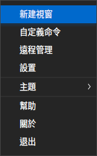

### 全螢幕顯示

1. 在終端界面，按下鍵盤上的 **F11** 鍵或單擊鼠標右鍵選擇 **全螢幕**，視窗將全螢幕顯示。
2. 如果要恢復正常大小顯示，按下鍵盤上的 **F11** 鍵或單擊鼠標右鍵選擇 **離開全螢幕**。

### 分割工作區

1. 在終端界面，單擊鼠標右鍵。
 - 選擇 **縱向分屏**，工作區被分為左右兩個部分。
 - 選擇 **橫向分屏**，工作區被分為上下兩個部分。
2. 您可以在各個工作區中輸入命令，並同時查看到命令執行的結果。

> 竅門 ：您也可以使用快捷鍵 **Ctrl + Shift + J** 縱向分屏、**Ctrl + Shift + H** 橫向分屏。

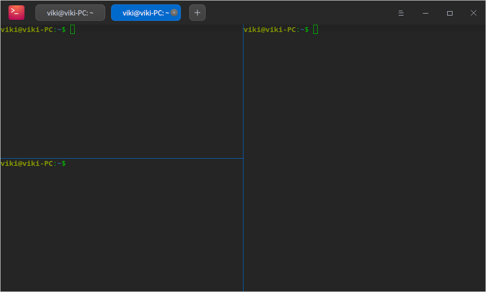

### 關閉工作區
執行以下操作來關閉工作區：

1. 在終端界面，將鼠標指針置於其中一個終端視窗中。
2. 單擊右鍵，您可以：
 - 選擇 **關閉工作區**，關閉此工作區。
 - 選擇 **關閉其他工作區**，關閉除此工作區以外的其他工作區。

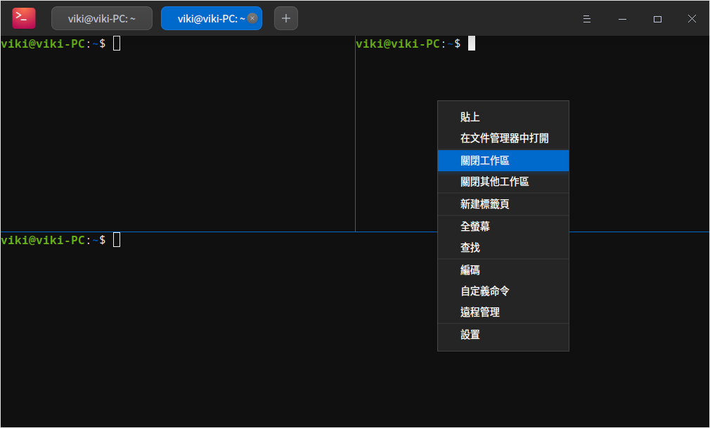

## 標籤頁操作

### 新建標籤頁

通過以下方法之一新建標籤頁：
- 在終端界面，單擊標籤頁上的按鈕 **+** ，新建一個標籤頁。
- 在終端界面，單擊鼠標右鍵，選擇 **新建標籤頁**。
- 使用快捷鍵 **Ctrl + Shift + T** 新建標籤頁。

### 切換/調整標籤頁
通過以下方法在多個標籤頁之間任意切換或調整：

- 使用快捷鍵 **Ctrl + Tab** 或將鼠標指針置於標籤頁上，滾動鼠標滾輪依次切換標籤頁。
- 使用快捷鍵 **Ctrl + Shift + 1~9** 數字鍵來選擇對應的標籤頁，當標籤頁大於9時，將選中最後一個標籤頁而不是第9個標籤頁。
- 同一窗口內拖拽標籤頁排序。
- 拖拽標籤頁移出當前窗口，創建一個新的窗口。
- 拖拽標籤頁從一個窗口到另一個窗口中。

### 重命名標籤頁

1. 在終端界面，右鍵單擊一個標籤頁。
2. 選擇 **重命名標題**。
   - 標籤標題格式：自定義當前標籤頁名稱；可在 **插入** 下拉選項中選擇一種格式。
   - 遠程標籤標題格式：自定義遠程標籤頁名稱；可在 **插入** 下拉選項中選擇一種格式。當工作區連接遠程伺服器時，標籤頁會顯示您所設置的參數。

3. 單擊 **確定**。

> 竅門 ：您也可以按下鍵盤上的 **F2** 來重命名標籤頁。

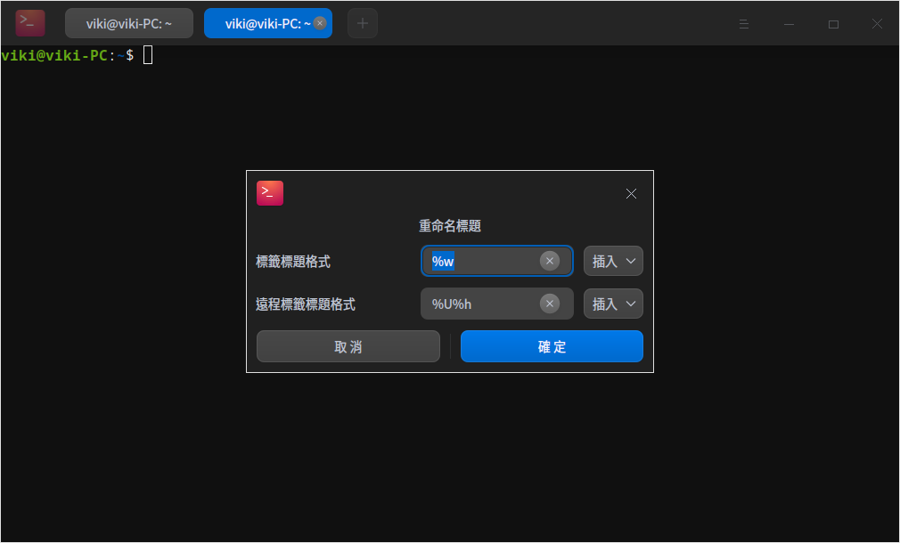

### 關閉標籤頁
通過以下方法之一關閉標籤頁：

- 選擇某一個標籤頁，單擊按鈕  關閉該標籤頁。
- 右鍵單擊某一個標籤頁：
   + 選擇 **關閉標籤頁**，關閉此標籤頁。
   + 選擇 **關閉其他標籤頁**，關閉除此標籤頁以外的其他標籤頁。

> 竅門：當該標籤頁中只有一個工作區時，使用右鍵 **關閉工作區** 也可以關閉當前標籤頁。

## 遠程管理

通過主菜單或者右鍵菜單打開遠程管理，將遠程伺服器添加到管理列表後，只需單擊一下便可以自動登錄。

### 添加伺服器
1. 在終端界面，選擇  > **遠程管理**。
2. 選擇 **添加伺服器**，彈出添加伺服器窗口。
3. 輸入 **伺服器名**、**地址**、**用戶名**、**密碼**。
4. 單擊 **添加**。

> 說明：在添加伺服器時，您可以單擊 **高級選項** 來設置更多參數。

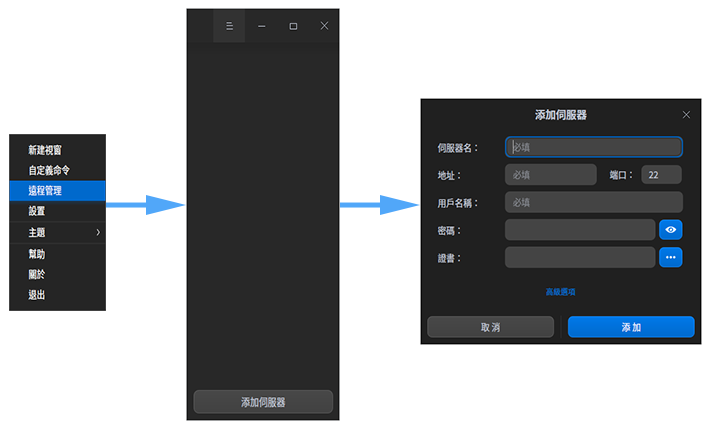

### 編輯伺服器
1.  打開終端遠程管理界面，將光標置於某一個伺服器上，則顯示編輯按鈕 ，單擊該按鈕彈出編輯伺服器窗口。
2.  修改伺服器名稱、地址等訊息。
3.  單擊 **保存**。

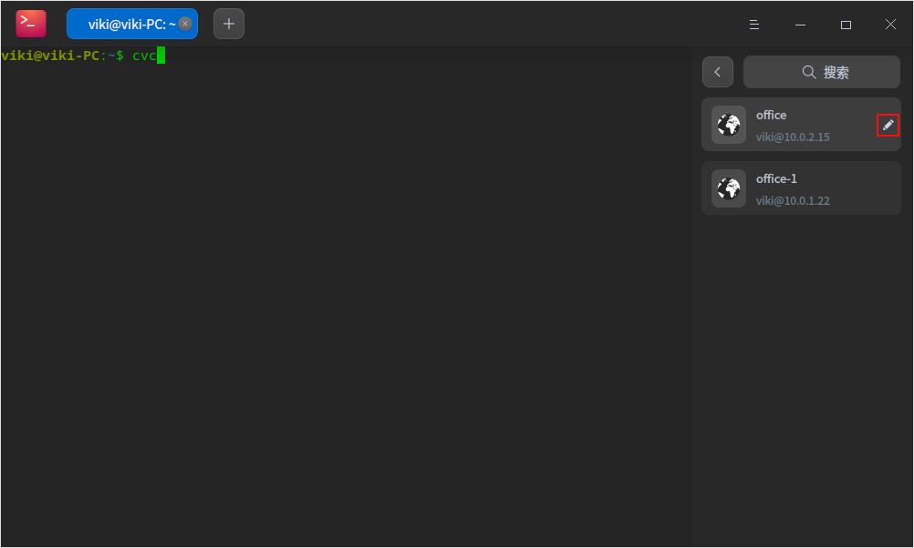

### 分組伺服器

添加伺服器時若設置了分組， 該伺服器會被添加到遠程管理對應的分組中。

1. 在終端遠程管理界面，打開添加伺服器或編輯伺服器窗口。
2. 單擊 **高級選項**。
3. 輸入 **分組** 訊息。
4. 單擊 **保存**。

### 搜索伺服器

當存在多個伺服器或伺服器分組時， 會在頂部顯示搜索輸入框， 可以快速搜索伺服器。

1. 在終端界面，單擊鼠標右鍵。
2. 選擇 **遠程管理**。
3. 在搜索框中輸入關鍵詞。
4. 按下鍵盤上的 **Enter** 鍵，顯示搜索結果。

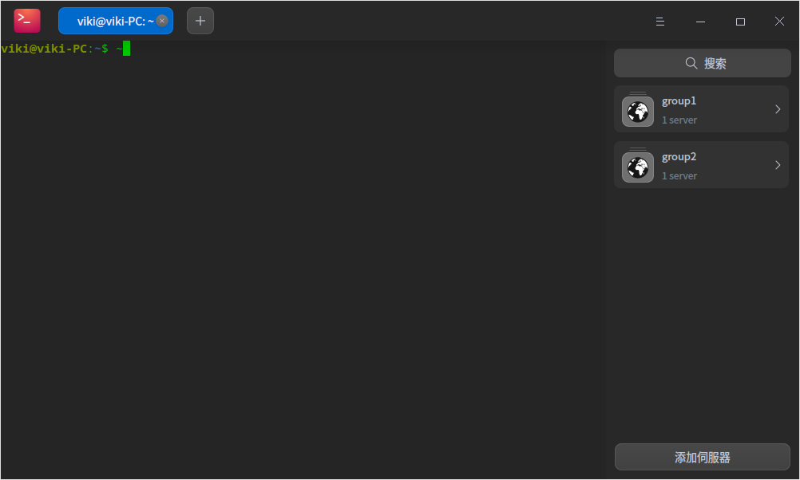

### 上傳和下載文件

登錄遠程伺服器之後，可以直接通過終端機上傳和下載文件。

#### 上傳文件

1. 在終端遠程管理界面，選擇一個伺服器登錄。
2. 單擊鼠標右鍵選擇 **上傳文件**。
3. 在彈出的窗口中選擇要上傳的文件。
5. 單擊 **上傳**，文件將被上傳到遠程伺服器。
> 竅門 ：連接到遠程伺服器後，您可直接將文件拖拽到終端來上傳。

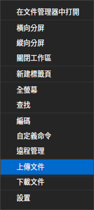

#### 下載文件

1. 在終端遠程管理界面，選擇一個伺服器登錄。
2. 單擊鼠標右鍵選擇 **下載文件**。
3. 在彈出的窗口中選擇文件要存放的位置。
4. 輸入要下載的文件路徑，文件將下載到指定位置。

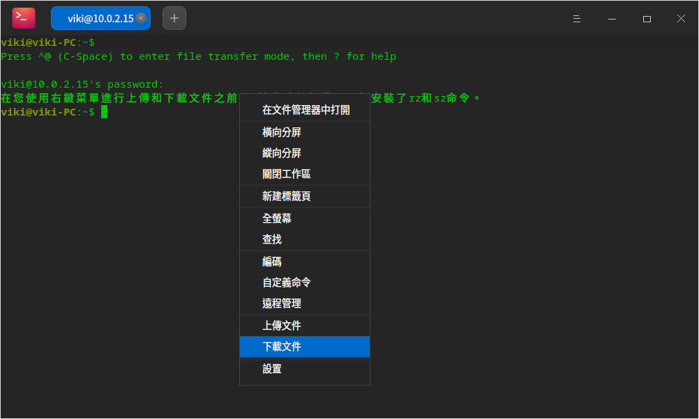

### 刪除伺服器

1. 在終端界面，打開編輯伺服器對話框。
2. 單擊 **高級選項**。
3. 單擊 **刪除伺服器**。
4. 彈出刪除伺服器對話框，單擊 **刪除** 來確認刪除伺服器。

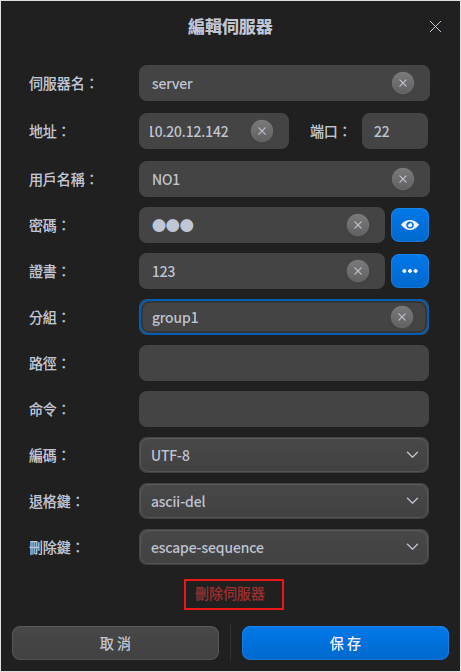

## 主菜單

在主菜單中，您可以[新建視窗](#新建視窗)、自定義命令、 [遠程管理](#遠程管理)、切換窗口主題、查看幫助手冊，了解終端的更多訊息。

### 主題

窗口主題支持多種主題模式，也支持自定義主題顏色。
1. 在終端界面，單擊 。
2. 選擇 **主題**，您可以：
   - 選擇終端自帶的主題。
   - 選擇自定義主題，在自定義主題窗口中，可分別設置主題風格、前景色、背景色和提示符的顏色。

### 自定義命令

添加自定義命令，通過快捷鍵快速調用命令。
1. 在終端界面，單擊  > **自定義命令**。
2. 選擇 **添加命令**。
3. 輸入命令的 **名稱**、**命令**、**快捷鍵**。
4. 單擊 **添加**。

### 設置

#### 基本設置

1. 在終端界面，單擊  > **設置**。
2. 在 **基本** 設置頁簽下，您可以：
   - 設置終端的背景透明度。
     
   >說明：當視窗特效關閉後，透明度調節功能將會被隱藏。
   
   - 設置終端機的字體樣式和字體大小。
   - 對終端中所有標籤及遠程標籤的標題進行設置。

#### 快捷鍵設置

1. 在終端界面，單擊  > **設置**。
2. 在 **快捷鍵** 頁簽下，您可以：
   - 修改快捷鍵：單擊要修改的快捷鍵，此時輸入框呈可編輯狀態，使用鍵盤輸入新的快捷鍵。
   - 禁用快捷鍵：單擊要修改的快捷鍵，此時輸入框呈可編輯狀態，按下鍵盤上的 **Backspace** 鍵。

#### 高級設置

1. 在終端界面，單擊   > **設置**。
2. 在 **高級設置** 頁簽下，您可以：
   - 設置光標樣式。
   - 開啟或關閉光標閃爍。
   - 開啟或關閉選中文字時自動複製到剪切板。
   - 選擇滾動效果。
   - 設置窗口默認大小。
   - 開啟或關閉背景模糊。
     
      >說明：當窗口特效關閉後，背景模糊選項將會被隱藏。
      
   - 開啟或關閉失去焦點自動隱藏雷神窗口。
   - 選擇Shell配置。
   - 開啟或禁用Ctrl+S和Ctrl+Q控制。

### 幫助

查看幫助手冊，進一步了解和使用終端。

1. 在終端界面，單擊 。
2. 選擇 **幫助**。
3. 查看終端的幫助手冊。

### 關於

1. 在終端界面，單擊 。
2. 選擇 **關於**。
3. 查看終端的版本和介紹。

### 退出

1. 在終端界面，單擊 。
2. 選擇 **退出**。