# 終端機|deepin-terminal|

## 概述

終端是⼀款集多窗⼝、⼯作區、遠端管理、雷神模式等功能的⾼級終端模擬器。它擁有簡單的介面，豐富而強大的功能。您可以瞬間啟動和關閉，使用起來像普通文件視窗一樣流暢，讓您在輸入指令時心無旁騖，得心應手。試試雷神模式，一邊看頁面一邊輸入指令；當有多任務進行時，您可以像在瀏覽器中增加頁籤一樣建立多個工作區或者將工作區分割成多個視窗；遠端管理，上傳下載檔案再也不是問題。更多強大功能，靜待您的發掘！

## 使用入門
透過以下方式執行或關閉終端機，或者建立終端機的捷徑。

### 執行終端機

1. 單擊任務欄上的啟動器圖示 ，進入啟動器介面。
2. 上下滾動滑鼠滾輪瀏覽或透過搜尋，找到終端機  單擊執行。
3. 右鍵單擊 ，您可以：
   - 單擊 **建立桌面捷徑**，在桌面建立捷徑。
   - 單擊 **釘選到Dock**，將應用程式固定到Dock中。
   - 單擊 **開機啟動**，將應用程式添加到開機啟動項，在電腦開機時自動執行該應用。

> 說明：按下鍵盤上的 **Ctrl + Alt + T** 快捷鍵也可以啟動終端機。

### 關閉終端機

- 在終端機介面單擊  ，關閉終端機。
- 在Dock中右鍵單擊 ，選擇 **全部關閉**， 關閉終端機。
- 在終端機介面單擊 ，選擇 **退出**， 關閉終端機。

> 說明：如果關閉終端機時終端裡面依然有程式在執行，會彈出對話框詢問使用者是否退出， 避免強制關閉引起的使用者資料遺失。

### 查看快捷鍵

在終端機介面上，使用快捷鍵 **Ctrl + Shift + ?** 打開快捷鍵預覽介面。熟練的使用快捷鍵，將大大提升您的操作效率。

 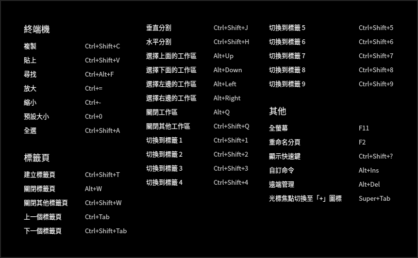

## 基本操作

您可以在終端機介面單擊滑鼠右鍵進行一般操作。

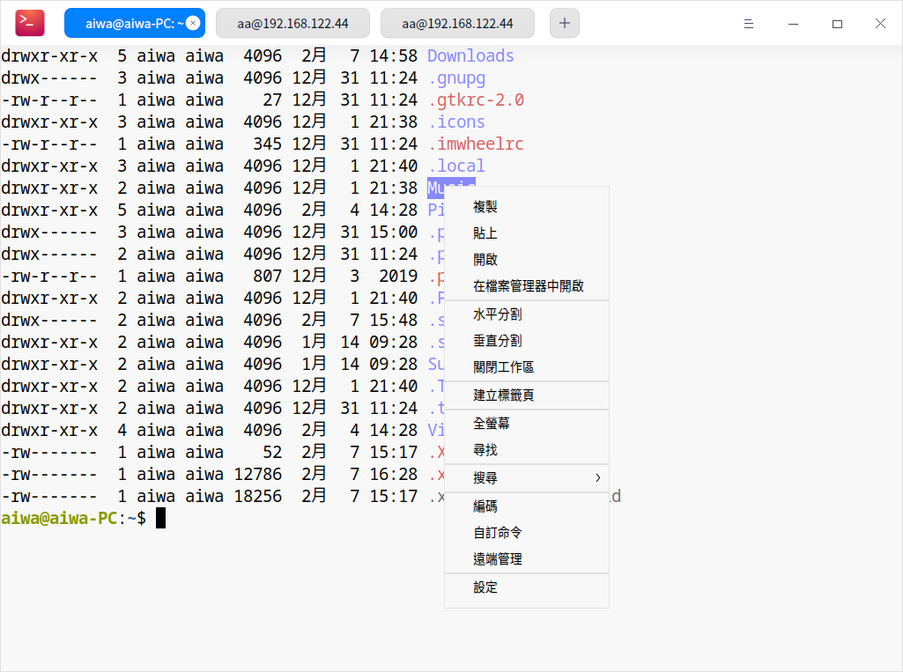

### 尋找 ###
您可以使用「尋找」功能快速尋找終端顯示的內容。
1. 在終端機介面，單擊滑鼠右鍵。
2. 單擊 **尋找**。
3. 在搜尋框中輸入要尋找的字元。
4. 按下鍵盤上的 **Enter** 鍵，搜尋到的結果將突顯顯示。
5. 如果想隱藏搜尋介面，可以單擊終端空白區域按下鍵盤上的 **Esc** 鍵。

> 竅門：搜尋時按下鍵盤上的 **Enter** 鍵，從目前位置向下搜尋，您也可以透過單擊搜尋介面上的  或   圖示向上搜尋或向下搜尋。

### 網頁搜尋 
使用「搜尋」功能可以呼叫瀏覽器，搜尋終端中的內容，快捷又方便。
1. 在終端機介面，選中想要搜尋的內容。
2. 單擊滑鼠右鍵，選擇 **搜尋**。
3. 在下拉選項中選擇一個網站搜尋選中的內容。

### 複製和貼上 

- 複製
   + 在終端機介面，選中要複製的內容後使用快捷鍵 **Ctrl + Shift + C** 複製內容。
   + 在終端機介面，選中要複製的內容後單擊滑鼠右鍵選擇 **複製**。
- 貼上
   + 在終端機介面，使用快捷鍵 **Ctrl + Shift + V** 組合貼上內容。
   + 在終端機介面，單擊滑鼠中鍵貼上內容。
   + 在終端機介面，單擊滑鼠右鍵選擇 **貼上**。

   >說明：
   >- 終端已預設開啟 **選取時複製**，您可以在 > **設定** 中進行修改。
   >- 如果目前游標下是超連結內容，即使沒有選中任何內容，也可以透過右鍵選單複製。

### 雷神模式

雷神模式是終端特有的便捷功能，使用快捷鍵 **Alt + F2** 打開雷神終端視窗，再按一下 **Alt + F2** 快捷鍵隱藏雷神終端視窗。

> 竅門：右鍵單擊Dock中的  圖示，選擇 **雷神模式終端器**，打開雷神模式的終端視窗。

### 開啟文件和應用程式

在終端機介面上選中目前目錄下的文件，右鍵選單會顯示 **開啟** 選單項，單擊 **開啟** 會呼叫系統的應用打開選中的文件。

1. 在終端機介面，輸入 **ls -al** 顯示目前目錄下的文件。
2. 雙擊滑鼠左鍵，選中檔案名。
3. 單擊滑鼠右鍵選擇 **開啟**。

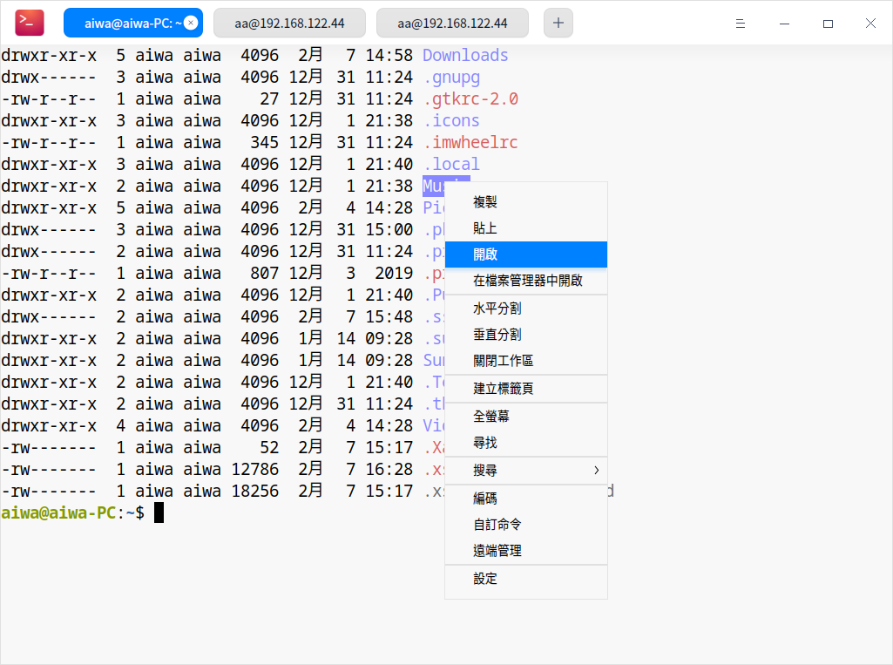

### 調整編碼方式 
當某些文件訊息顯示亂碼或者錯誤時，可以透過調整編碼方式解決問題。

1. 在終端機介面，單擊滑鼠右鍵。
2. 選擇 **編碼**。
3. 在右側展開的面板中，選擇一種編碼方式並查看調整後的效果。
4. 重複步驟3直到內容顯示正確。

> 說明：通常終端機都會匹配正確的編碼方式，一些特殊情況下出現錯誤後，可以手動調整編碼方式，如果您確定需要哪種編碼方式，可以直接選擇，不確定的情況下可以多嘗試幾次。

## 視窗操作

視窗是終端實現各種功能的基礎，可以建立多個標籤頁，也可以分割多個工作區。

### 新增視窗 

在啟動器介面開啟終端，可以透過以下方法新增視窗：

 - 選擇 > **新增視窗**，打開一個新的終端視窗。
 - 右鍵單擊任務欄上的  圖示，選擇 **新增視窗**。

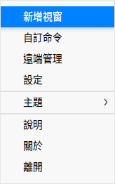

### 全螢幕顯示

1. 在終端機介面，按下鍵盤上的 **F11** 鍵或單擊滑鼠右鍵選擇 **全螢幕**，終端視窗將全螢幕顯示。
2. 如果要復原正常大小顯示，按下鍵盤上的 **F11** 鍵或單擊滑鼠右鍵選擇 **退出全螢幕**。

### 分割工作區 

1. 在終端機介面，單擊滑鼠右鍵。
 - 選擇 **水平分割**，工作區被分為左右兩個部分。
 - 選擇 **垂直分割**，工作區被分為上下兩個部分。
2. 您可以在各個工作區中輸入指令，並可以同時查看到指令執行的結果。

> 竅門：您也可以使用快捷鍵 **Ctrl + Shift + J** 縱向分屏、 **Ctrl + Shift + H** 橫向分屏。

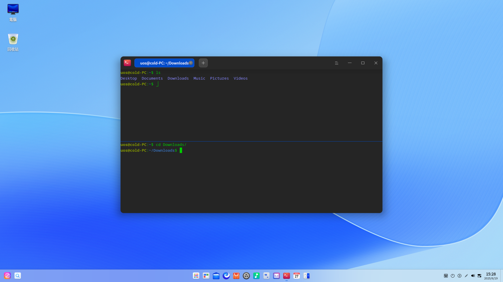
### 關閉工作區
執行以下步驟關閉多個工作區：

1. 在終端機介面上，將滑鼠遊標置於其中一個工作區中。
2. 單擊滑鼠右鍵，您可以：

 - 選擇 **關閉工作區**，關閉此工作區。
 - 選擇 **關閉其他工作區**，關閉除此工作區以外的其他工作區。

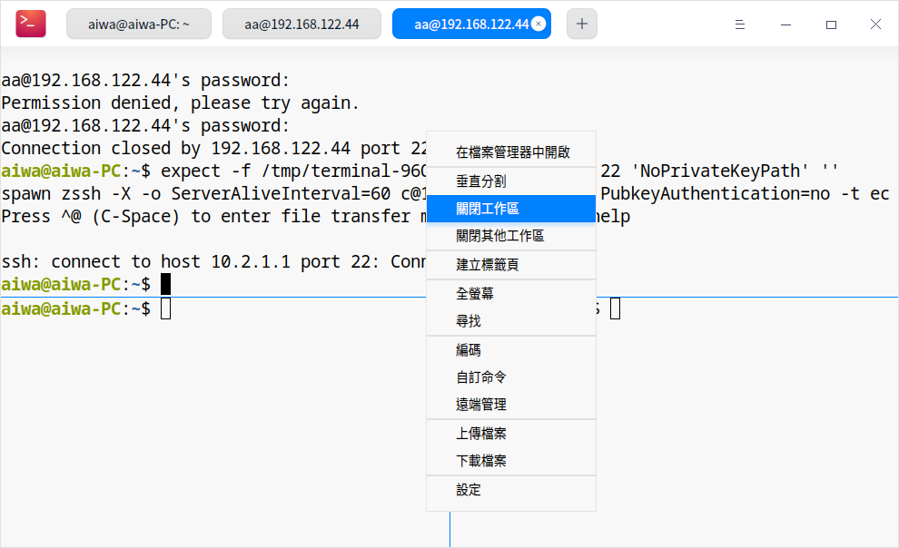

## 標籤頁操作

### 建立標籤頁

透過以下方法建立標籤頁：

- 在終端機介面上，單擊標籤頁上的 **+** 建立標籤頁。

- 在終端機介面上，單擊滑鼠右鍵，選擇 **建立標籤頁**。

- 使用快捷鍵 **Ctrl + Shift + T** 建立標籤頁。

### 切換/調整標籤頁

透過以下方法在多個標籤頁之間任意切換或調整：

- 使用快捷鍵 **Ctrl + Tab** 或將滑鼠游標置於分頁上，滾動滑鼠滾輪依次切換分頁。
- 使用快捷鍵 **Ctrl + Shift + 1~9** 數字鍵選擇對應的分頁，當分頁大於9時，將選中最後一個分頁而不是第9個分頁
- 同一視窗內拖曳標籤頁排序。
- 拖曳標籤頁移出目前視窗，建立一個新的視窗。
- 拖曳標籤頁從一個視窗到另一個視窗中。

### 重命名分頁

1. 在終端機介面，右鍵單擊一個標籤頁。
2. 選擇 **重命名分頁**。
   - 標籤標題格式：自訂目前標籤頁名稱；可在 **插入** 下拉選項中選擇一種格式。
   - 遠端標籤標題格式：自訂遠端標籤頁名稱；可在 **插入** 下拉選項中選擇一種格式。當工作區連接遠端伺服器時，標籤頁會顯示您所設置的參數。

3. 單擊 **確定**。

> 竅門：您也可以按下鍵盤上的 **F2** 重新命名標籤頁。

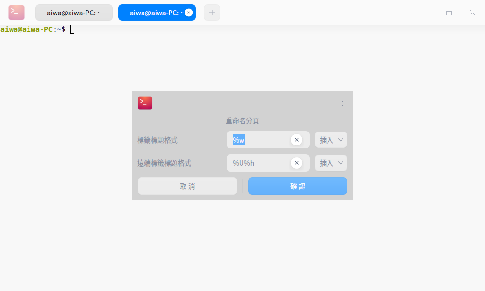

### 關閉標籤頁

透過以下方式關閉標籤頁：

- 單擊標籤頁上的按鈕關閉該標籤頁。
- 右鍵單擊標籤頁：
  + 選擇 **關閉標籤頁**，關閉此標籤頁。
  + 選擇 **關閉其他標籤頁**，關閉除此標籤頁以外的其他標籤頁。

> 竅門：當該標籤頁中只有一個工作區時，使用右鍵 **關閉工作區** 也可以關閉目前標籤頁。

## 遠端管理

終端機可以透過主選單或者右鍵選單開啟遠端管理，將遠端伺服器添加到管理列表後，只需單擊一下便可自動登入。

### 加入伺服器
1. 在終端機介面上，選擇 > **遠端管理**。
2. 選擇 **加入伺服器**，彈出添加伺服器對話框。
3. 輸入 **伺服器名稱**、**位址**、**使用者名稱**、**密碼**。
4. 單擊 **添加**。
> 說明：在添加伺服器時，您可以單擊 **進階選項** 設定更多參數。

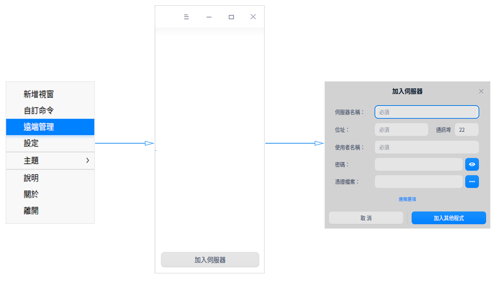

### 編輯伺服器
1.  開啟終端遠端管理介面，將游標置於某一個伺服器上，則顯示按鈕 ，單擊該按鈕彈出編輯伺服器視窗。
2.  修改伺服器訊息。
3.  單擊 **儲存**。

### 分組伺服器

添加伺服器時若設定了分組，該伺服器會添加到遠端管理對應的分組中。

1. 在終端機介面上，打開添加伺服器或編輯伺服器視窗。
2. 單擊 **進階選項**。
3. 輸入 **分組** 訊息。
4. 單擊 **添加**。

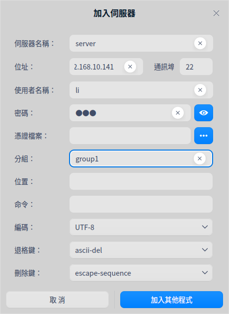

### 搜尋伺服器
當存在多個伺服器或伺服器分組時，伺服器列表中會顯示搜尋輸入框，可快速搜尋伺服器。

1. 在終端機介面上，單擊滑鼠右鍵。
2. 選擇 **遠端管理**。
3. 在搜尋框中輸入關鍵字。
4. 按下鍵盤上的 **Enter** 鍵，顯示搜尋結果。

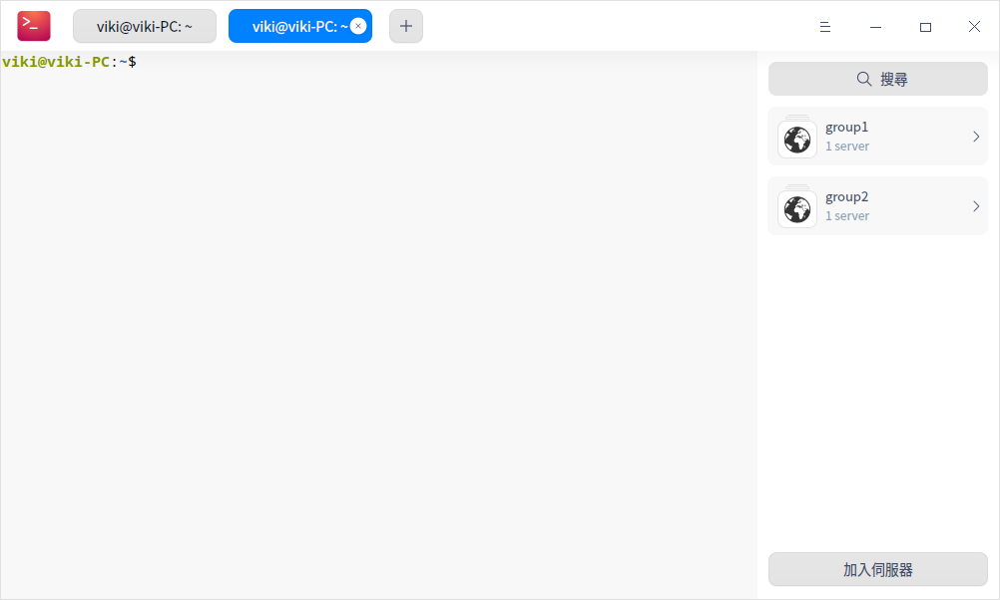

### 上傳和下載檔案
登入遠端伺服器之後，可以直接透過終端上傳和下載檔案。

#### 上傳檔案

1. 在終端遠端管理介面上，選擇一個伺服器登入。
2. 單擊滑鼠右鍵選擇 **上傳檔案**。
3. 在彈出的视窗中選擇要上傳的檔案。
4. 單擊 **上傳**，檔案將被上傳到遠端伺服器。

>  竅門：連接到遠端伺服器後，您可直接將檔案拖曳到終端上傳。

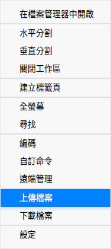

#### 下載檔案

1. 在終端遠端管理介面上，選擇一個伺服器登入。
2. 單擊滑鼠右鍵選擇 **下載檔案**。
3. 在彈出的视窗中，選擇下載檔案存放位置。
4. 輸入要下載的檔案路徑，檔案將下載到指定位置。

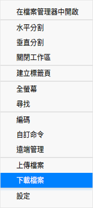

### 刪除伺服器

1. 在終端機介面上，打開編輯伺服器對話框。
2. 單擊 **進階選項**。
3. 單擊 **刪除伺服器**。
4. 彈出刪除伺服器對話框，單擊 **刪除**，確認刪除伺服器。

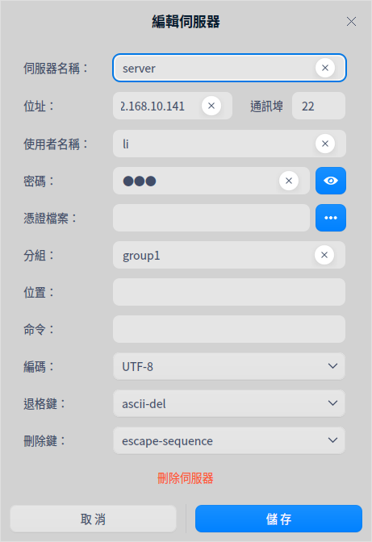

## 主選單

在主選單中，您可以[新增視窗](#新增視窗)、自訂指令、[遠端管理](#遠端管理)、切換視窗主題、查看說明手冊，了解終端的更多訊息。

### 主題

視窗主題支援多種主題模式，也支援自訂主題顏色。

1. 在終端機介面，單擊  。
2. 選擇 **主題**，您可以：
   - 選擇終端自帶的主題。
   - 選擇自訂主題，在自訂主題視窗中，可分別設定主題風格、前景色、背景色和提示符的顏色。

### 自訂命令 

添加自訂命令，透過快捷鍵可快速呼叫命令。

1. 在終端機介面，單擊  > **自訂命令**。
2. 單擊 **加入命令**。
3. 輸入指令的 **名稱**、**命令**、**快捷鍵**。
4. 單擊 **添加**。

### 設定

#### 基本設定 

1. 在終端機介面，單擊  > **設定**。
2. 在 **基本設定** 頁簽下，您可以：
   - 設定終端機的背景透明度。
   >說明：當視窗特效關閉後，透明度調節功能將會被隱藏。
   
   - 選擇終端機字型樣式和字型大小。
   - 對終端機中所有標籤及遠端標籤的標題進行設定。

#### 快捷鍵設定 

1. 在終端機介面，單擊  > **設定**。
2. 在 **快捷鍵** 頁簽下，您可以：
   - 修改快捷鍵：單擊要修改的快捷鍵，此時輸入框呈可編輯狀態，使用鍵盤輸入新的快捷鍵。
   - 禁用快捷鍵：單擊要修改的快捷鍵，此時輸入框呈可編輯狀態，按下鍵盤上的 **Backspace** 鍵。

#### 進階設定 

1. 在終端機介面，單擊   > **設定**。
2. 在 **進階設定** 頁簽下，您可以：
   - 設定游標樣式。
   - 開啟或關閉游標閃爍。
   - 開啟或關閉選取時複製。
   - 選擇捲動效果。
   - 設定啟動視窗時預設大小。
   - 開啟或關閉背景模糊。
   >說明：當視窗特效關閉後，背景模糊選項將會被隱藏。
   
   - 終端機或關閉失去焦點自動隱藏雷神視窗。
   -  選擇Shell配置。
   - 開啟或禁用Ctrl+S和Ctrl+Q控制。

### 說明

1. 在終端機介面，單擊  。
2. 單擊 **說明**。
3. 查看終端機的說明手冊。

### 關於

1. 在終端機介面，單擊  。
2. 單擊 **關於**。
3. 查看終端機的版本和介紹。

### 退出

1. 在終端機介面，單擊 。
2. 單擊 **退出**。